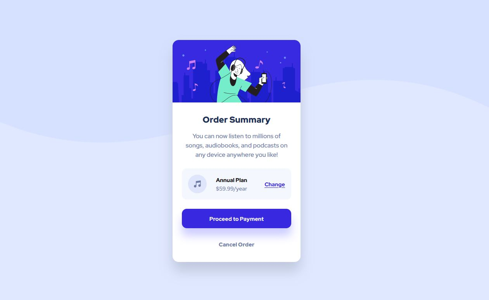

# Frontend Mentor - Order summary card solution

This is a solution to the [Order summary card challenge on Frontend Mentor](https://www.frontendmentor.io/challenges/order-summary-component-QlPmajDUj). Frontend Mentor challenges help you improve your coding skills by building realistic projects. 

## Table of contents

- [Overview](#overview)
  - [The challenge](#the-challenge)
  - [Screenshot](#screenshot)
  - [Links](#links)
- [My process](#my-process)
  - [Built with](#built-with)
  - [What I learned](#what-i-learned)
  - [Useful resources](#useful-resources)
- [Author](#author)

**Note: Delete this note and update the table of contents based on what sections you keep.**

## Overview

### The challenge

Users should be able to:

- See hover states for interactive elements

### Screenshot




### Links

- Solution URL: [Github link](https://github.com/Quakumei/fm-order-summary-component)
- Live Site URL: [Live site URL](https://fm-order-summary-component-quakumei.vercel.app/)

## My process

### Built with

- Semantic HTML5 markup
- CSS custom properties
- Flexbox
- CSS Grid
- Mobile-first workflow


### What I learned

- Ignoring parent padding [stackoverflow](https://stackoverflow.com/questions/4296530/ignore-parent-padding): 
```css
margin:-10px
```
- Adaptive css depenging on width of the screen
```css
@media only screen and (min-width: 100vh) {
    body { 
        background-image: url("images/pattern-background-desktop.svg");
        background-repeat: no-repeat;
        background-size: 100%;
    }
}
```

### Useful resources

- [stackoverflow question](https://stackoverflow.com/questions/4296530/ignore-parent-padding) - One of the best and short answers I've ever seen (Ignoring parent padding).

## Author

- Frontend Mentor - [@Quakumei](https://www.frontendmentor.io/profile/Quakumei)
- Github - [@Quakumei](https://github.com/Quakumei)
